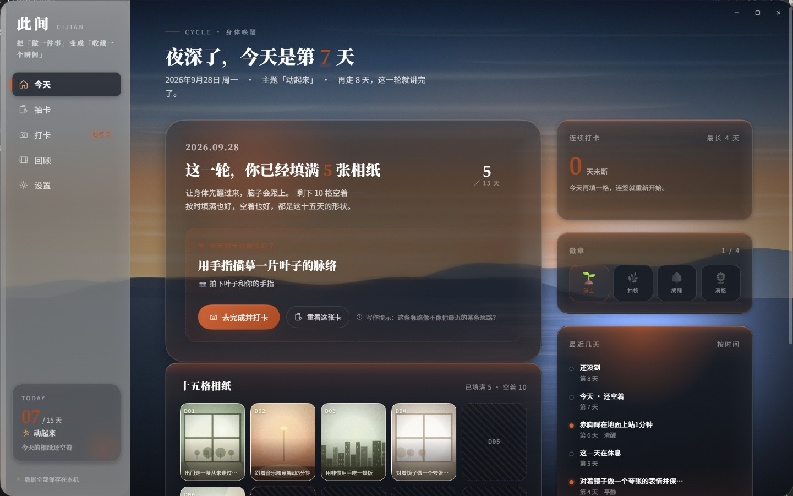
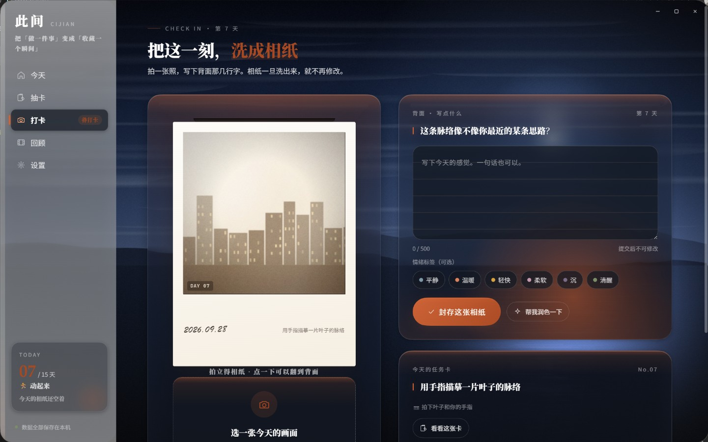

# 此间 · 玻璃材质与主题探索（桌面 Demo）

> ## ⬇️ 下载（Windows 免安装）
>
> ### **[→ 点这里下载 Cijian-0.3.0-portable.exe](https://github.com/Rhys443/CiJIan/releases/latest)**
>
> | | |
> |---|---|
> | 文件 | `Cijian-0.3.0-portable.exe`（约 100 MB，Electron 打包的免安装单文件） |
> | 系统 | Windows 10 / 11 64 位 |
> | 安装 | **不需要安装**。双击即可运行；首次启动约 3–5 秒 |
> | 数据 | 全部存在本机（`%APPDATA%\Cijian`），不联网、不上传 |
> | 卸载 | 删掉这个 exe 就行（想连数据一起清掉，再删 `%APPDATA%\Cijian`） |
>
> ⚠️ 未做代码签名，Windows SmartScreen 可能提示"未知发布者"——
> 点「更多信息」→「仍要运行」即可。这是 Demo 的正常状态，不是文件损坏。

## 这个 Demo 主要展示什么

**玻璃材质** 与 **主题系统** 的探索更新。界面上的每一块玻璃都不是 CSS `backdrop-filter`，
而是一层 **WebGL2 实时渲染的光学层** —— 斯涅尔折射、RGB 色散、菲涅尔边缘、
可按面板单独调的形状剖面，全部在一个片元着色器里算完。

**这一版（0.3.0）主要动了三件事：**

| | 做了什么 | 为什么 |
|---|---|---|
| **边缘剖面** | 四分之一圆 → **smootherstep**（两端一阶二阶导都为 0） | 圆角剖面在边界处导数无穷 = 表面以 90° 撞上边框，那就是"玻璃砖接缝 / 有直角"的来源 |
| **边缘明暗** | 边界上的亮度台阶 → **贴边为 0 的鼓包** | 原来轮廓处比面板外暗一档，边界两侧差一层亮度 —— 这是**明暗**上的线，形状再顺滑也消不掉 |
| **极光模式换材质** | 极光（无底图）时卡片去掉玻璃，改**微微透光 + 一点点高斯模糊**；侧栏保留玻璃当分界 | 玻璃的折射 + 白色高光 + 边缘压暗压在暖白上是互相抵消的，净剩一层灰 |

**主题系统** 也理顺成一条链：**底图**决定背景并自带一个推荐强调色 → **强调色**可以手动覆盖它
（七色 + 自动）→ **明暗**只决定玻璃厚薄与取色档位，不再决定颜色。
周期主题（这一轮练什么）从此**只管内容**，不再改颜色。

另外这一版把左下角那张 TODAY 卡做成了**入口**：按住缩小、松手弹出一整块日历
（这一轮 15 天是哪 15 天、走到第几天、任务池），全程连续变形 —— 从哪来，回哪去。

<p align="center">
  
</p>

---

## 操作一图流

| 想做什么 | 怎么做 |
|---|---|
| 换一页 | 左侧栏点，或按 `1`–`5` |
| 抽今天的卡 | 「抽卡」→ 洗牌 → 点牌堆翻牌 |
| 打卡 | 「打卡」→ 选画面或传本机图片 → 等 2.4s 冲印 → 写背面 → 提交 |
| **看这一轮走到哪了** | **点左下角那张 TODAY 卡** —— 它会从卡片长成一块完整日历（15 天范围、今天第几天、任务池都在里面），`Esc` 或点空白处收起 |
| 换界面颜色 | 设置 → 外观 → 强调色（或用「自动」跟着底图走） |
| 换背景 | 设置 → 外观 → 底图（黄昏 / 林间 / 夜色 / 传自己的照片或视频 / 移除底图＝极光） |
| 觉得玻璃太糊或太清 | 设置 → 外观 → 强调色下面那根滑杆 |
| 备份 | 设置 → 数据 → 导出 JSON |

---

## 三套外观

三套彼此独立的外观语言。背景不是图片，是一层 **WebGL2 实时渲染的光学层** ——
极光在缓慢漂移，玻璃板面按真实折射把背景掰弯。下面全是实机截图。

### 浅色 · 暖纸（默认）


### 深色 · 暗房


### 空间 · 玻璃

近黑底 + 冷色玻璃语言，主题色整体切成冷蓝。


---

## 这是什么

依据《「此间」APP 产品规划与零基础零成本 MVP 落地方案》实现的**桌面端界面 Demo**。
它不追求功能完整，只把产品文档里最关键的 P0 界面与**仪式感动效**做到接近成品：

| 文档里的 P0 功能 | Demo 里的状态 |
|---|---|
| 15 天周期管理 | ✅ 可切换主题、显示倒计时与进度环 |
| 每日抽卡 | ✅ 洗牌 → 发牌 → 悬停升温 → 3D 翻卡 → 任务披露（每轮任务不重复，每日可换 1 次） |
| 拍立得打卡 | ✅ 选画面/用本机图片 → 相纸吐出 → **2.4s 冲印显影** → 写背面 → 可选润色 → 提交 |
| 打卡日历视图 | ✅ 15 格相纸墙，已完成显示照片、空着显示空白相纸框 |
| 15 天回顾页 | ✅ 相纸墙 + 节奏统计 + 情绪轨迹曲线 + 本地生成的回顾文字 |
| 本地数据存储 | ✅ localStorage 持久化，支持导出 JSON 备份 |
| 每日提醒推送 | ⚠️ 只有设置项界面，未接系统通知 |

**Demo 的既定约束**：不开真实相机（用程序化生成的胶片感画面代替）、不联网（AI 润色与回顾摘要为本地规则生成）。

---

## 运行

**最简单的方式：双击桌面上的「此间」快捷方式。**
（如果桌面上没有，执行 `npm run shortcut` 可以重新创建。）

打包好的单文件程序在 `dist\Cijian-0.2.0-portable.exe`，双击即用、免安装。

### 从源码运行

```bash
# 依赖已随项目一起放在 node_modules 里，可直接启动
npm start

# 或者不用 npm：
.\node_modules\electron\dist\electron.exe .
```

### 打包成单文件 exe

```bash
npm run dist
```

会在 `dist/` 下生成 `Cijian-0.2.0-portable.exe`。

> **打包失败怎么办？** 如果报错
> `Cannot create symbolic link : 客户端没有所需的特权 ... libcrypto.dylib`，
> 这是 electron-builder 的已知问题（`winCodeSign` 压缩包里有两个 macOS 用的软链接，
> Windows 普通权限下解不开，而这两个文件在 Windows 打包里根本用不到）。
> 先执行一次 `npm run dist` 让它把包下载下来（会失败），然后运行：
>
> ```powershell
> powershell -ExecutionPolicy Bypass -File dev\fix-builder-cache.ps1
> ```
>
> 再重新 `npm run dist` 即可。

> 如果 `npm` 提示无法加载 `npm.ps1`（PowerShell 执行策略限制），用 `npm.cmd` 代替，或改用
> `Set-ExecutionPolicy -Scope Process RemoteSigned`。

---

## 常用命令

| 命令 | 作用 |
|---|---|
| `npm start` | 从源码启动应用 |
| `npm run shortcut` | 在桌面创建/更新「此间」快捷方式 |
| `npm run icon` | 重新生成应用图标（`build/icon.ico` + 各尺寸 PNG） |
| `npm run dist` | 打包成单文件 exe |
| `npm run syntax` | 校验所有 JS 的语法与编码残留 |
| `npm run probe` | 跑一遍全流程自检并截图到 `.shots/` |

**图标是怎么来的**：`dev/build-icon.js` 用 Electron 把 SVG 渲染成 7 个尺寸的 PNG
（16/24/32/48/64/128/256），再用纯 Node 手写的 PNG 编码器 + ICO 封装器合成 `icon.ico`，
全程不依赖 ImageMagick 之类的二进制工具。小尺寸（≤32px）会自动切换成「双层方印」简形，
因为 16px 下「此」字的笔画会糊在一起。

---

## 目录结构

```
D:\Cijian
├─ main.js                     Electron 主进程：无边框窗口、窗口控件、数据导出、文档校验
├─ preload.js                  contextBridge 暴露的安全 API（contextIsolation: true）
├─ package.json                依赖与打包配置
├─ renderer/
│  ├─ index.html               应用外壳（自绘标题栏 + 左侧导航 + 内容区 + 氛围层）
│  ├─ css/
│  │  ├─ tokens.css            ★ 设计令牌：颜色 / 字号 / 间距 / 圆角 / 阴影 / 动效
│  │  ├─ base.css              重置、氛围层（暖光/纸纹/颗粒/暗角）、外壳与通用组件
│  │  ├─ polaroid.css          ★ 拍立得相纸：冲印显影、翻面、颗粒、手写体
│  │  ├─ home.css              首页：进度环、15 格网格、面板
│  │  ├─ draw.css              抽卡页：牌堆、洗牌、3D 翻卡、任务披露
│  │  ├─ checkin.css           打卡页：相纸舞台、写作区、情绪标签、润色
│  │  ├─ review.css            日历墙 / 回顾页 / 设置页 / 弹层
│  │  ├─ glass.css             ★ 液态玻璃覆盖层（照片模式的配色迁移也在这一层）
│  │  └─ background.css        底图选择器（预设芯片 / 上传入口）
│  └─ js/
│     ├─ data.js               ★ 数据层：任务池（30 张卡）、周期、打卡、徽章、统计、localStorage
│     ├─ ui.js                 动效引擎：h()、icon()、tween、spring、stagger、粒子、吐司
│     ├─ optics.js             ★ WebGL2 光学层：极光、照片底图、真实折射玻璃，一个着色器画完
│     ├─ background.js         ★ 底图：程序化预设、上传文件的加载与持久化
│     ├─ photo.js              程序化「照片」生成器（Canvas：8 种画面 + 胶片调色 + 颗粒）
│     ├─ polaroid.js           ★ 相纸组件：create / develop / eject / flip / blank
│     ├─ router.js             路由、导航、单日大图弹层、键盘快捷键
│     ├─ app.js                启动、无边框窗口控件、开幕动画
│     └─ views/                home / draw / checkin / calendar / review / settings
├─ docs/
│  └─ 设计规范.md              ★ 设计规范（Apple HIG 对齐说明）
├─ build/                      图标资源（icon.ico + 各尺寸 PNG）
├─ dist/                       打包产物（Cijian-0.2.0-portable.exe）
├─ dev/                        开发期自检工具
│  ├─ probe.js                 冒烟测试 + 自动截图（CJ_PROBE=1）
│  ├─ shot.js                  实机截图（desktopCapturer 抓屏后裁窗口矩形）
│  ├─ presets.js               把三张程序化预设底图导出成图片单独看
│  ├─ optics-check.js          光学层自检：面板、GPU、帧率、backdrop-filter 审计
│  ├─ diag.js                  渲染/编码诊断
│  ├─ check-syntax.js          语法与编码自检
│  ├─ build-icon.js            生成应用图标
│  ├─ make-shortcut.ps1        创建桌面快捷方式
│  └─ fix-builder-cache.ps1    修复 electron-builder 打包报错
└─ .shots/                     自检产生的截图
```

### 截图工具为什么不用 `capturePage()`

`webContents.capturePage()` 在「`transparent: true` 的窗口 + 铺满全屏的 WebGL 画布」
这个组合下会**永久挂起**，而且挂住之后 Electron 进程不会自己退出。

`dev/shot.js` 改走 `desktopCapturer`：抓整个屏幕，再按窗口矩形裁掉四周。
此间的窗口没有对系统隐藏自己，所以屏幕上看到什么就能抓到什么 ——
抓到的正是用户眼里的画面，比离屏截取更有说服力。

```bash
electron dev/shot.js <route> <mode> <名字> [预设] [--clean] [--probe] [--audit] [--bottom]
```

| 开关 | 作用 |
|---|---|
| `--clean` | 先清掉记住的底图再重载（不清的话「不传预设」的对照组其实还带着上次的底图） |
| `--probe` | 打印运行时状态：底图来源、`data-bg`、解析后的令牌值、关键元素的实算背景 |
| `--audit` | 把所有可见文字按计算颜色分组 —— 一屏几十处文字，肉眼数不清 |
| `--bottom` | 截图前把内容区滚到底（设置页的「背景」卡片在折叠线以下） |

---

## 主界面与动效

### 首页「今天」
- 大字问候 + 当日日期 + 主题标签
- **进度环**：`stroke-dashoffset` 补间 + 数字滚动
- **今日任务卡**：已抽卡 / 未抽卡 / 已完成三态
- **15 格网格**：已打卡显示相纸缩略图，今天有呼吸光环，未到的日子降低不透明度
- 右栏：连续打卡天数、火焰刻度、四枚徽章（3/7/10/15 天）、最近几天时间线、一句温柔的话

### 抽卡页
```
洗牌(scatter + blur 11px, 错峰 45ms) → 发牌(从上方落入, 错峰 110ms)
→ 悬停升温(上浮 18px + 前移 80px) → 选中放大 → 3D 翻卡(1050ms)
→ 其余牌淡出 → 粒子迸发 → 任务披露面板
```
牌背有「牌堆厚度」的接触阴影，牌面是暖白纸 + 难度星 + 拍照指引。
抽到的卡会真正写进本地状态，**每轮 10 张不重复，每天可换 1 次**。

### 打卡页

相纸**从上方一条窄缝里慢慢吐出来**（2.6 秒，整张当刚体），停稳之后才开始 2.4 秒的
冲印显影 —— 显影只动滤镜与透明度、不动几何，因为真实相纸的图像是在纸面上
原位长出来的，不会缩放。


整页最有质感的 2.4 秒就在这里：

1. **吐纸**：相纸从出纸槽下方滑出并轻微回弹（`cubic-bezier` 过冲）
2. **冲印显影**：同时驱动 blur / brightness / contrast / saturate / sepia / hue-rotate —— 
   先是一片过曝的空白，带一点偏冷绿的乳剂感，然后暗部才从白里长出来；配一道显影液扫光
3. **写背面**：点相纸翻到背面，横格纸上是手写体感想
4. **提交**：粒子迸发，相纸重新显影后翻回正面

### 日历墙 / 回顾页

日历墙已与回顾页合并：照片排成一条**围绕行星旋转的圆环**，自动缓慢旋转，
悬停时停下、照片放大并做翻卡抽卡。切到网格视图则是 15 格相纸墙。


- 日历墙：15 张相纸按「手工摆放」的随机角度贴在墙上，悬停转正并抬起；空着的日子是斜纹空白相纸
- 回顾页：本地生成的回顾文字逐字浮现、四项统计数字滚动、**Canvas 手绘情绪轨迹**（Catmull-Rom 平滑 + 逐段揭示）、15 张相纸错峰浮现的相纸墙

### 设置页

三套外观在这里切换。设置页同样带跟手光效。


### 键盘快捷键
| 键 | 作用 |
|---|---|
| `1` – `6` | 今天 / 抽卡 / 打卡 / 日历墙 / 回顾 / 设置 |
| `H` `D` `C` `R` | 今天 / 抽卡 / 打卡 / 回顾 |
| `Esc` | 关闭弹层 |

---

## 液态玻璃：一层真实的折射，不是毛玻璃

界面上的每一块玻璃都不是 `backdrop-filter` 糊出来的。整个背景 + 所有玻璃面板
由**一块 WebGL2 画布、一个片元着色器**一次画完，走的是真实的光学模型。

**为什么可以这么做**：玻璃背后的东西就是此间自己的极光 —— 它是程序化的、
完全在掌控之中。所以既不需要屏幕捕获，也不需要把 DOM 拍平成纹理。

### 光学模型

| 环节 | 做法 |
|---|---|
| 轮廓 | SDF 圆角矩形，Lp 范数归一化；指数取 2（正圆角），与 CSS `border-radius` 严格对齐 |
| 剖面 | `G(t) = a·t − (a−e)·t²`，`a = 6 − 2e`；`t = 1` 在轮廓、`t = 0` 在倒角内缘 |
| 折射 | 斯涅尔定律，玻璃 `n = 1.52`，**R / G / B 三个波长各折射一次** → 真实色散 |
| 高光 | Schlick 菲涅尔，`F0 = ((n−1)/(n+1))² = 0.0426`；**颜色沿反射方向从背景采样**，全项目没有任何固定白色描边 |
| 磨砂 | 加宽高斯。极光是高斯光斑的叠加，高斯卷高斯仍是高斯，所以这是数学上精确的模糊，比多趟 Kawase 倒 FBO 更快也更准 |
| 中频起伏 | 叠一层约 170px / 79px 的淡噪声。折射得先有东西可弯，才看得出来 |

### 三区透镜是同一条曲线推出来的

`G(t)` 先增后减，所以位移映射 `u → u + D(t)` **不是单调的**：过了极值点
`t* = a / (2(a−e))` 之后采样点会折返，外圈于是自然反相。

中心不变形 / 内圈压缩 / 外圈反向 —— 这三个区不是三个手调的效果，
而是这一条剖面的必然结果。


*把剖面直接画出来（`?optics=zones`）：**蓝** = 位移递减（外圈反向），
**绿** = 位移递增（内圈压缩），**红** = 光学平坦（中心不变形）。*

### 性能

| | WebGL 光学层 | CSS 回退 |
|---|---|---|
| 帧率 | **241 fps** | 241 fps |
| `backdrop-filter` 存活元素 | **0** | 4（只剩侧栏与标题栏那两条静态模糊分割带） |
| 代码体积 | 新增 28 KB，同时**删除 60 KB** 的旧依赖 | — |

WebGL2 不可用时自动退回原来的 CSS 极光（`?optics=0` 可强制走回退路径），
观感一致，只是没有折射。

---

## 底图：把自己的照片铺在最底层

设置页的「背景」可以选择一张照片或一段视频，铺在窗口最底层，界面整个变成
压在上面的半透明玻璃。不设底图时仍然是程序化极光 —— 那是原来就调好的一档，
不设底图时一点不动。





- **三张程序化预设**（黄昏 / 林间 / 夜色）用 Canvas 现画，不占仓库体积、
  不依赖网络、永远加载成功。它们只是「开箱即用」的兜底，真正好看的是用户自己传的图。
- **上传支持图片（jpg/png/webp/gif/bmp）与视频（mp4/webm/mov/m4v）**，
  视频静音循环播放，上限 200 MB。
- **上传的图/视频落盘，不进 localStorage**。一张手机照片 3–8 MB，塞 localStorage
  必然爆配额，而且爆了会连带把打卡数据一起写失败 —— 那才是真的数据事故。
  文件由主进程复制到 `userData/background/`，渲染进程只存文件名。
- **用自定义协议 `bg://` 读，不用 `file://`**。既绕开 Chromium 对本地文件的限制，
  也能在主进程里挡住目录穿越。这个协议自己实现 HTTP Range，
  因为 `net.fetch` 对 `file:` 会忽略 Range，而尾部带 moov atom 的 MP4
  （手机拍的常见）必须先拿到文件尾才能起播。

### 玻璃会跟着底图亮度自适应

底图换成照片之后，「一套固定配色」是行不通的 —— 照片可能很暗，也可能很亮。
实测黄昏预设中间那条太阳带会把面板照成暖橙色，压在上面的白字当场失去背衬。
所以照片模式下有三处按底图平均亮度（`envAvg`）自动调整：

| 环节 | 做法 |
|---|---|
| 压暗层 | 底图越亮压得越多（0.20 → 0.48），视频逐帧重算，渲染循环里平滑逼近，不会忽明忽暗 |
| 面板本体 | 亮度拉回固定区间：暗底略提、亮底压暗，保证玻璃透出多亮的东西，白字都有背衬 |
| 强调色 | `--theme` 负责**填充**（主按钮渐变，上面压近白文字，天生偏暗），`--theme-text` 负责**文字与描边**。照片模式下只提亮后者，色相不变，三套主题的心情还是各自那一套 |

CSS 表面在照片模式下同样从「一层很薄的白」改成**烟熏暗玻璃**：
白纱叠在亮底图上等于面板跟着亮，白字失去背衬；暗玻璃则不管底图多亮，
面板都稳定落在「比背景暗」的位置。这也正是 macOS 与 iOS 在照片上做 vibrancy 的做法。

> 相纸是唯一的例外：它必须**始终实心暖白**。相纸在模拟实体纸张，透出底图会毁掉这个隐喻。

---

## 设计规范

完整说明见 [`docs/设计规范.md`](docs/设计规范.md)。要点：

**以 Apple Human Interface Guidelines 为基准**
<https://developer.apple.com/design/human-interface-guidelines>

- **Clarity**：字号层级（Large Title 34 / Title1 28 / Headline 17 / Body 15 / Footnote 12）承担信息层级，不靠边框和分割线堆砌
- **Deference**：界面材料退让于内容，相纸始终是屏幕上最亮的东西；只在模态遮罩用一次 `backdrop-filter`
- **Depth**：分层阴影（接触层 + 关键层 + 环境层）表达高度，阴影色统一为暖棕而非纯黑
- **字体栈**：Latin 走 SF Pro 系统栈，中文走苹方；标题用宋体表达「被记录」的语气，感想用楷体表达手写
- **半透明材料**：标题栏与侧栏用 `backdrop-filter: blur() saturate()`
- **命中区域**：交互控件最小高度 40px（对应 HIG 的 44pt）
- **无障碍**：双色焦点环（墨色描边 + 纸色光晕）、尊重 `prefers-reduced-motion`、设置页可单独关闭动效

**三处「叙事动效」不受界面动效预算约束**（这是刻意的，也是产品气质所在）：
显影 2400ms · 抽卡翻面 1050ms · 交卷庆祝 1100ms。
其余界面动效一律控制在 120–560ms。

---

## 开发期自检

```bash
npm run syntax   # 校验 19 个 JS 文件的语法与编码
npm run probe    # 启动隐藏窗口跑一遍全流程，输出截图到 .shots/
```

`probe` 会检查：六个视图能否全部渲染、15 格网格是否齐全、弹层能否打开、
文档 sha256 是否匹配，并把每个页面截图保存。

---

## 已知限制

- **没有真实相机**：照片由 `photo.js` 用 Canvas 程序化生成（8 种画面 + 胶片调色 + 颗粒），
  也可以用设置里的「本机图片」入口换成真实照片
- **底图视频只验证过 H.264/MP4 与 VP8/VP9/WebM**：Electron 预编译版不带
  全部专有编解码器，冷门编码可能不出画
- **AI 是本地规则**：润色只做语句顺滑，回顾摘要从用户自己的文字里提炼关键词，不联网
- **没有系统通知**：提醒时间只是设置项
- **只在 Windows 上验证过**：无边框窗口的窗口控件是按 Windows 习惯自绘的

---

## 与产品文档的对应关系

| 文档章节 | 落地位置 |
|---|---|
| 4.2 任务分类框架 | `data.js` 的 `THEMES`（身体/创造力/连接唤醒） |
| 4.3 三个主题任务池 | `data.js` 的 `RAW`（30 张卡，文案逐条取自文档） |
| 5.2 打卡激励体系 | 提交粒子动画、日历点亮、3/7/10/15 徽章 |
| 5.3 提醒策略 | 设置页的时间预设与文案预览 |
| 5.4 反沉迷与健康边界 | 无排行榜、无社交比较的界面已经体现 |
| 6.3 Prompt 工程 | 设置页与打卡页的润色入口（Demo 用本地规则） |
| 7.1 回顾页信息架构 | `views/review.js` 完整实现 |
| 7.3 回顾页情感设计 | 不打分、允许空白、空白相纸配文 |
| 9.4 心理安全 | 回顾页底部的心理援助热线提示 |

---

## 更新日志

### 0.2.0

- **新增：照片 / 视频底图。** 三张程序化预设 + 上传自己的图或视频，铺在窗口最底层，
  界面变成压在上面的半透明玻璃。上传的文件由主进程落盘到 `userData/background/`。
- **玻璃按底图亮度自适应。** 压暗层、面板亮度、强调色文字三处跟着底图平均亮度走，
  保证任意一张照片（很暗或很亮）上面白字都读得出来。
- **强调色拆成两个令牌。** `--theme` 负责填充，`--theme-text` 负责文字与描边 ——
  否则「把强调色调亮到能看清」会同时把主按钮的渐变背景毁掉。
- 修复：程序化预设底图（Canvas）永远传不进着色器 —— 取尺寸时只看了
  `naturalWidth / videoWidth`，而 Canvas 两个都没有，于是纹理从未上传。
- 修复：**上传自己的图 / 视频整条功能曾经是坏的**。页面跑在 `file://` 下，
  `bg://` 对它来说是另一个源，媒体资源因此被判为「被污染」，
  WebGL 的 `texImage2D` 每帧都抛 `contains cross-origin data`，纹理永远是空的 ——
  而 `readyState`、`backgroundReady`、`uBgMode` 全部正常，只有画面是黑的。
  主进程开 `corsEnabled` + `Access-Control-Allow-Origin`，渲染进程给
  `/<video>` 设 `crossOrigin="anonymous"`（必须在 `src` 之前），两边齐了才干净。
  程序化预设直接拿 Canvas 当纹理，完全不受影响，所以这个坑一直没被发现。
- 修复：`bg://` 现在自己实现 HTTP Range（`net.fetch` 对 `file:` 会忽略 Range）。
  否则尾部带 moov atom 的 MP4（手机拍的常见）必须先整个下完才能起播。
- 修复：上传时 `copyFileSync` 卡死主进程（上限 200 MB）→ 改异步流式。
- 修复：视频底图每帧 `getImageData` 回读拖慢渲染 → 降到每 12 帧一次。
- 修复：纹理上传失败被 `catch` 静默吞掉 → 记在 `backgroundUploadError` 上，自检可读。
- 修复：设置页「背景 / 数据 / 关于」三张卡片因为滚动容器认错而够不到。
- 修复：走完 15 天后没有入口开始下一轮（`startNextCycle()` 一直没人调用）。
- 工具：新增 `dev/shot.js`（实机截图）与 `dev/presets.js`（导出预设底图）。
  截图不再用 `capturePage()` —— 它在透明窗口 + 全屏 WebGL 画布下会永久挂起。

---

*本项目为界面概念 Demo，用于验证「此间」的视觉与动效方向。*
