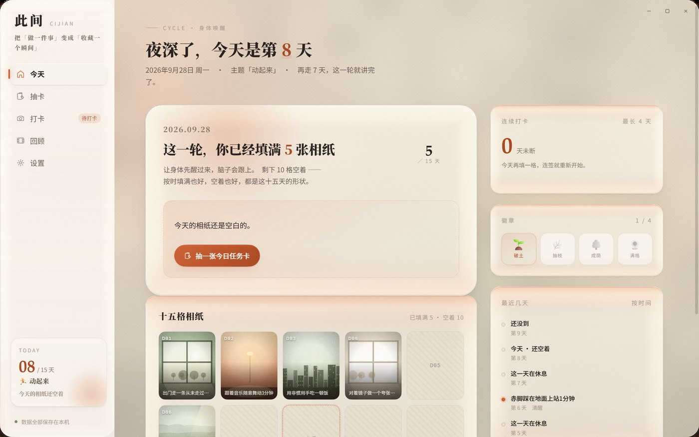
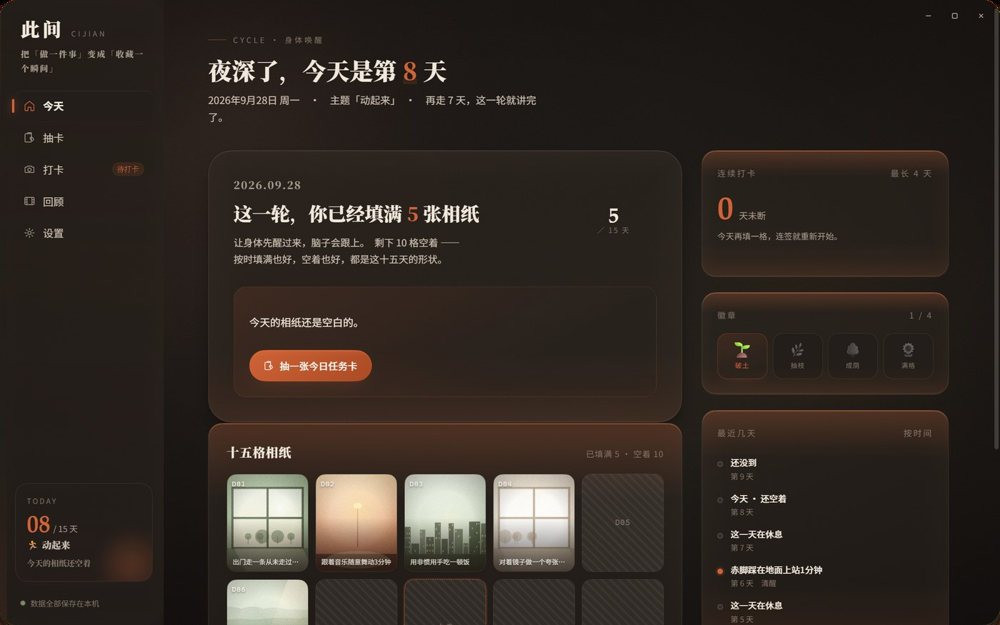
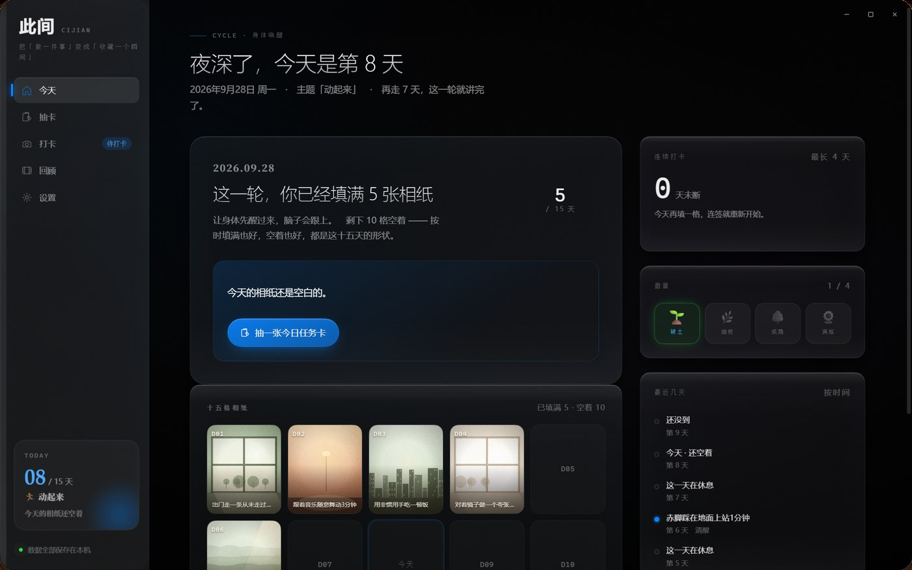
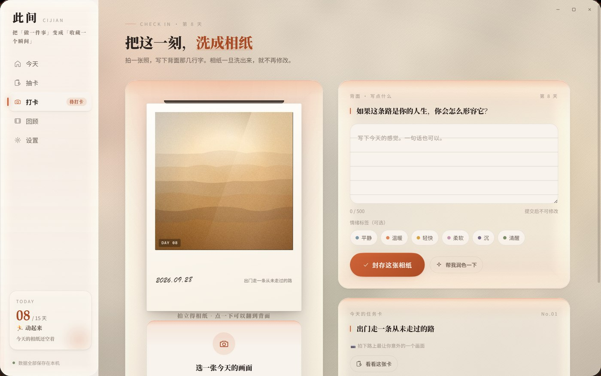

# 此间 · 15天唤醒计划（桌面 Demo）

> 定格此刻瞬间 · 15天唤醒计划
> 一个把「做一件事」变成「收藏一个瞬间」的仪式感工具
> Windows 桌面概念 Demo · Electron + 原生 JS/CSS · 无框架、无动画库

<p align="center">
  
</p>

---

## 三套外观

三套彼此独立的外观语言。背景不是图片，是一层 **WebGL2 实时渲染的光学层** ——
极光在缓慢漂移，玻璃板面按真实折射把背景掰弯。下面全是实机截图。

### 浅色 · 暖纸（默认）


### 深色 · 暗房



### 空间 · 玻璃

近黑底 + 冷色玻璃语言，主题色整体切成冷蓝。



---

## 这是什么

依据《「此间」APP 产品规划与零基础零成本 MVP 落地方案》实现的**桌面端界面 Demo**。
它不追求功能完整，只把产品文档里最关键的 P0 界面与**仪式感动效**做到接近成品：

| 文档里的 P0 功能 | Demo 里的状态 |
|---|---|
| 15 天周期管理 | ✅ 可切换主题、显示倒计时与进度环 |
| 每日抽卡 | ✅ 洗牌 → 发牌 → 悬停升温 → 3D 翻卡 → 任务披露（每轮任务不重复，每日可换 1 次） |
| 拍立得打卡 | ✅ 选画面/用本机图片 → 相纸吐出 → **2.4s 冲印显影** → 写背面 → 可选润色 → 提交 |
| 打卡日历视图 | ✅ 15 格相纸墙，已完成显示照片、空着显示空白相纸框 |
| 15 天回顾页 | ✅ 相纸墙 + 节奏统计 + 情绪轨迹曲线 + 本地生成的回顾文字 |
| 本地数据存储 | ✅ localStorage 持久化，支持导出 JSON 备份 |
| 每日提醒推送 | ⚠️ 只有设置项界面，未接系统通知 |

**Demo 的既定约束**：不开真实相机（用程序化生成的胶片感画面代替）、不联网（AI 润色与回顾摘要为本地规则生成）。

---

## 运行

**最简单的方式：双击桌面上的「此间」快捷方式。**
（如果桌面上没有，执行 `npm run shortcut` 可以重新创建。）

打包好的单文件程序在 `dist\Cijian-0.1.0-portable.exe`，98 MB，双击即用、免安装。

### 从源码运行

```bash
# 依赖已随项目一起放在 node_modules 里，可直接启动
npm start

# 或者不用 npm：
.\node_modules\electron\dist\electron.exe .
```

### 打包成单文件 exe

```bash
npm run dist
```

会在 `dist/` 下生成 `Cijian-0.1.0-portable.exe`。

> **打包失败怎么办？** 如果报错
> `Cannot create symbolic link : 客户端没有所需的特权 ... libcrypto.dylib`，
> 这是 electron-builder 的已知问题（`winCodeSign` 压缩包里有两个 macOS 用的软链接，
> Windows 普通权限下解不开，而这两个文件在 Windows 打包里根本用不到）。
> 先执行一次 `npm run dist` 让它把包下载下来（会失败），然后运行：
>
> ```powershell
> powershell -ExecutionPolicy Bypass -File dev\fix-builder-cache.ps1
> ```
>
> 再重新 `npm run dist` 即可。

> 如果 `npm` 提示无法加载 `npm.ps1`（PowerShell 执行策略限制），用 `npm.cmd` 代替，或改用
> `Set-ExecutionPolicy -Scope Process RemoteSigned`。

---

## 常用命令

| 命令 | 作用 |
|---|---|
| `npm start` | 从源码启动应用 |
| `npm run shortcut` | 在桌面创建/更新「此间」快捷方式 |
| `npm run icon` | 重新生成应用图标（`build/icon.ico` + 各尺寸 PNG） |
| `npm run dist` | 打包成单文件 exe |
| `npm run syntax` | 校验所有 JS 的语法与编码残留 |
| `npm run probe` | 跑一遍全流程自检并截图到 `.shots/` |

**图标是怎么来的**：`dev/build-icon.js` 用 Electron 把 SVG 渲染成 7 个尺寸的 PNG
（16/24/32/48/64/128/256），再用纯 Node 手写的 PNG 编码器 + ICO 封装器合成 `icon.ico`，
全程不依赖 ImageMagick 之类的二进制工具。小尺寸（≤32px）会自动切换成「双层方印」简形，
因为 16px 下「此」字的笔画会糊在一起。

---

## 目录结构

```
D:\Cijian
├─ main.js                     Electron 主进程：无边框窗口、窗口控件、数据导出、文档校验
├─ preload.js                  contextBridge 暴露的安全 API（contextIsolation: true）
├─ package.json                依赖与打包配置
├─ renderer/
│  ├─ index.html               应用外壳（自绘标题栏 + 左侧导航 + 内容区 + 氛围层）
│  ├─ css/
│  │  ├─ tokens.css            ★ 设计令牌：颜色 / 字号 / 间距 / 圆角 / 阴影 / 动效
│  │  ├─ base.css              重置、氛围层（暖光/纸纹/颗粒/暗角）、外壳与通用组件
│  │  ├─ polaroid.css          ★ 拍立得相纸：冲印显影、翻面、颗粒、手写体
│  │  ├─ home.css              首页：进度环、15 格网格、面板
│  │  ├─ draw.css              抽卡页：牌堆、洗牌、3D 翻卡、任务披露
│  │  ├─ checkin.css           打卡页：相纸舞台、写作区、情绪标签、润色
│  │  └─ review.css            日历墙 / 回顾页 / 设置页 / 弹层
│  └─ js/
│     ├─ data.js               ★ 数据层：任务池（30 张卡）、周期、打卡、徽章、统计、localStorage
│     ├─ ui.js                 动效引擎：h()、icon()、tween、spring、stagger、粒子、吐司
│     ├─ photo.js              程序化「照片」生成器（Canvas：8 种画面 + 胶片调色 + 颗粒）
│     ├─ polaroid.js           ★ 相纸组件：create / develop / eject / flip / blank
│     ├─ router.js             路由、导航、单日大图弹层、键盘快捷键
│     ├─ app.js                启动、无边框窗口控件、开幕动画
│     └─ views/                home / draw / checkin / calendar / review / settings
├─ docs/
│  └─ 设计规范.md              ★ 设计规范（Apple HIG 对齐说明）
├─ build/                      图标资源（icon.ico + 各尺寸 PNG）
├─ dist/                       打包产物（Cijian-0.1.0-portable.exe）
├─ dev/                        开发期自检工具
│  ├─ probe.js                 冒烟测试 + 自动截图（CJ_PROBE=1）
│  ├─ diag.js                  渲染/编码诊断
│  ├─ check-syntax.js          语法与编码自检
│  ├─ build-icon.js            生成应用图标
│  ├─ make-shortcut.ps1        创建桌面快捷方式
│  └─ fix-builder-cache.ps1    修复 electron-builder 打包报错
└─ .shots/                     自检产生的截图
```

---

## 主界面与动效

### 首页「今天」
- 大字问候 + 当日日期 + 主题标签
- **进度环**：`stroke-dashoffset` 补间 + 数字滚动
- **今日任务卡**：已抽卡 / 未抽卡 / 已完成三态
- **15 格网格**：已打卡显示相纸缩略图，今天有呼吸光环，未到的日子降低不透明度
- 右栏：连续打卡天数、火焰刻度、四枚徽章（3/7/10/15 天）、最近几天时间线、一句温柔的话

### 抽卡页
```
洗牌(scatter + blur 11px, 错峰 45ms) → 发牌(从上方落入, 错峰 110ms)
→ 悬停升温(上浮 18px + 前移 80px) → 选中放大 → 3D 翻卡(1050ms)
→ 其余牌淡出 → 粒子迸发 → 任务披露面板
```
牌背有「牌堆厚度」的接触阴影，牌面是暖白纸 + 难度星 + 拍照指引。
抽到的卡会真正写进本地状态，**每轮 10 张不重复，每天可换 1 次**。

### 打卡页

相纸**从上方一条窄缝里慢慢吐出来**（2.6 秒，整张当刚体），停稳之后才开始 2.4 秒的
冲印显影 —— 显影只动滤镜与透明度、不动几何，因为真实相纸的图像是在纸面上
原位长出来的，不会缩放。


整页最有质感的 2.4 秒就在这里：

1. **吐纸**：相纸从出纸槽下方滑出并轻微回弹（`cubic-bezier` 过冲）
2. **冲印显影**：同时驱动 blur / brightness / contrast / saturate / sepia / hue-rotate —— 
   先是一片过曝的空白，带一点偏冷绿的乳剂感，然后暗部才从白里长出来；配一道显影液扫光
3. **写背面**：点相纸翻到背面，横格纸上是手写体感想
4. **提交**：粒子迸发，相纸重新显影后翻回正面

### 日历墙 / 回顾页

日历墙已与回顾页合并：照片排成一条**围绕行星旋转的圆环**，自动缓慢旋转，
悬停时停下、照片放大并做翻卡抽卡。切到网格视图则是 15 格相纸墙。


- 日历墙：15 张相纸按「手工摆放」的随机角度贴在墙上，悬停转正并抬起；空着的日子是斜纹空白相纸
- 回顾页：本地生成的回顾文字逐字浮现、四项统计数字滚动、**Canvas 手绘情绪轨迹**（Catmull-Rom 平滑 + 逐段揭示）、15 张相纸错峰浮现的相纸墙

### 设置页

三套外观在这里切换。设置页同样带跟手光效。


### 键盘快捷键
| 键 | 作用 |
|---|---|
| `1` – `6` | 今天 / 抽卡 / 打卡 / 日历墙 / 回顾 / 设置 |
| `H` `D` `C` `R` | 今天 / 抽卡 / 打卡 / 回顾 |
| `Esc` | 关闭弹层 |

---

## 液态玻璃：一层真实的折射，不是毛玻璃

界面上的每一块玻璃都不是 `backdrop-filter` 糊出来的。整个背景 + 所有玻璃面板
由**一块 WebGL2 画布、一个片元着色器**一次画完，走的是真实的光学模型。

**为什么可以这么做**：玻璃背后的东西就是此间自己的极光 —— 它是程序化的、
完全在掌控之中。所以既不需要屏幕捕获，也不需要把 DOM 拍平成纹理。

### 光学模型

| 环节 | 做法 |
|---|---|
| 轮廓 | SDF 圆角矩形，Lp 范数归一化；指数取 2（正圆角），与 CSS `border-radius` 严格对齐 |
| 剖面 | `G(t) = a·t − (a−e)·t²`，`a = 6 − 2e`；`t = 1` 在轮廓、`t = 0` 在倒角内缘 |
| 折射 | 斯涅尔定律，玻璃 `n = 1.52`，**R / G / B 三个波长各折射一次** → 真实色散 |
| 高光 | Schlick 菲涅尔，`F0 = ((n−1)/(n+1))² = 0.0426`；**颜色沿反射方向从背景采样**，全项目没有任何固定白色描边 |
| 磨砂 | 加宽高斯。极光是高斯光斑的叠加，高斯卷高斯仍是高斯，所以这是数学上精确的模糊，比多趟 Kawase 倒 FBO 更快也更准 |
| 中频起伏 | 叠一层约 170px / 79px 的淡噪声。折射得先有东西可弯，才看得出来 |

### 三区透镜是同一条曲线推出来的

`G(t)` 先增后减，所以位移映射 `u → u + D(t)` **不是单调的**：过了极值点
`t* = a / (2(a−e))` 之后采样点会折返，外圈于是自然反相。

中心不变形 / 内圈压缩 / 外圈反向 —— 这三个区不是三个手调的效果，
而是这一条剖面的必然结果。


*把剖面直接画出来（`?optics=zones`）：**蓝** = 位移递减（外圈反向），
**绿** = 位移递增（内圈压缩），**红** = 光学平坦（中心不变形）。*

### 性能

| | WebGL 光学层 | CSS 回退 |
|---|---|---|
| 帧率 | **241 fps** | 241 fps |
| `backdrop-filter` 存活元素 | **0** | 4（只剩侧栏与标题栏那两条静态模糊分割带） |
| 代码体积 | 新增 28 KB，同时**删除 60 KB** 的旧依赖 | — |

WebGL2 不可用时自动退回原来的 CSS 极光（`?optics=0` 可强制走回退路径），
观感一致，只是没有折射。

---

## 设计规范

完整说明见 [`docs/设计规范.md`](docs/设计规范.md)。要点：

**以 Apple Human Interface Guidelines 为基准**
<https://developer.apple.com/design/human-interface-guidelines>

- **Clarity**：字号层级（Large Title 34 / Title1 28 / Headline 17 / Body 15 / Footnote 12）承担信息层级，不靠边框和分割线堆砌
- **Deference**：界面材料退让于内容，相纸始终是屏幕上最亮的东西；只在模态遮罩用一次 `backdrop-filter`
- **Depth**：分层阴影（接触层 + 关键层 + 环境层）表达高度，阴影色统一为暖棕而非纯黑
- **字体栈**：Latin 走 SF Pro 系统栈，中文走苹方；标题用宋体表达「被记录」的语气，感想用楷体表达手写
- **半透明材料**：标题栏与侧栏用 `backdrop-filter: blur() saturate()`
- **命中区域**：交互控件最小高度 40px（对应 HIG 的 44pt）
- **无障碍**：双色焦点环（墨色描边 + 纸色光晕）、尊重 `prefers-reduced-motion`、设置页可单独关闭动效

**三处「叙事动效」不受界面动效预算约束**（这是刻意的，也是产品气质所在）：
显影 2400ms · 抽卡翻面 1050ms · 交卷庆祝 1100ms。
其余界面动效一律控制在 120–560ms。

---

## 开发期自检

```bash
npm run syntax   # 校验 19 个 JS 文件的语法与编码
npm run probe    # 启动隐藏窗口跑一遍全流程，输出截图到 .shots/
```

`probe` 会检查：六个视图能否全部渲染、15 格网格是否齐全、弹层能否打开、
文档 sha256 是否匹配，并把每个页面截图保存。

---

## 已知限制

- **没有真实相机**：照片由 `photo.js` 用 Canvas 程序化生成（8 种画面 + 胶片调色 + 颗粒），
  也可以用设置里的「本机图片」入口换成真实照片
- **AI 是本地规则**：润色只做语句顺滑，回顾摘要从用户自己的文字里提炼关键词，不联网
- **没有系统通知**：提醒时间只是设置项
- **只在 Windows 上验证过**：无边框窗口的窗口控件是按 Windows 习惯自绘的

---

## 与产品文档的对应关系

| 文档章节 | 落地位置 |
|---|---|
| 4.2 任务分类框架 | `data.js` 的 `THEMES`（身体/创造力/连接唤醒） |
| 4.3 三个主题任务池 | `data.js` 的 `RAW`（30 张卡，文案逐条取自文档） |
| 5.2 打卡激励体系 | 提交粒子动画、日历点亮、3/7/10/15 徽章 |
| 5.3 提醒策略 | 设置页的时间预设与文案预览 |
| 5.4 反沉迷与健康边界 | 无排行榜、无社交比较的界面已经体现 |
| 6.3 Prompt 工程 | 设置页与打卡页的润色入口（Demo 用本地规则） |
| 7.1 回顾页信息架构 | `views/review.js` 完整实现 |
| 7.3 回顾页情感设计 | 不打分、允许空白、空白相纸配文 |
| 9.4 心理安全 | 回顾页底部的心理援助热线提示 |

---

*本项目为界面概念 Demo，用于验证「此间」的视觉与动效方向。*
